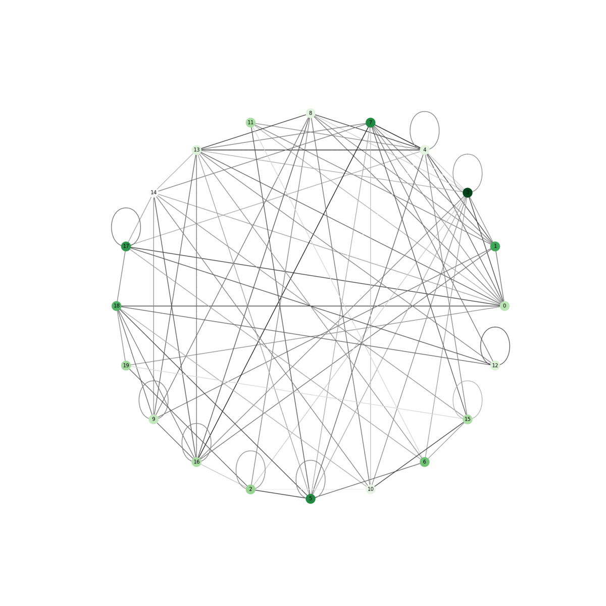

# Adaptive Interaction Network (AIN)



AIN, or Adaptive Interaction Network, is an advanced machine learning model that is designed to handle complex feature interactions in a flexible, adaptive, and learnable way. This architecture is built on the concept of graph-based neural networks, which makes it versatile enough to handle a diverse range of data types such as tabular, image, and language data.


## Table of Contents
* **Introduction**
* **Installation**
* **Usage**
* **Defining AIN Model**
* **AIN Forward Pass**
* **Util Functions**
* **Examples**
* **Contributing**
* **License**

## Introduction
### Motivation
Traditional neural network architectures often lack flexibility in modeling intricate feature interactions, especially when it comes to exploring structural relationships within the data. The Adaptive Interaction Network (AIN) is designed to address this limitation. By leveraging a graph-based structure, AINs have the unique advantage of being able to learn and adapt the structure of connections between features, creating a more nuanced and effective representation of data.

### Unique Features and Benefits
AINs introduce a few innovative features that set them apart from other neural networks:

* **Adaptive Graph Structure:** AINs can learn the optimal structure of connections between features during training, enabling the network to adaptively adjust its structure based on the task at hand.

* **Directionality and Loop Control:** AINs allow for control over the directionality of the graph (unidirectional, randomly directed, or bidirectional) and the number of loops (interactions), providing more flexibility in modeling complex data relationships.

* **Self-Loops:** AINs have an option to allow or disallow self-loops in the graph, which can be crucial depending on the nature of the problem and the type of data.

* **Bias Control:** The inclusion of bias is also a configurable parameter in AINs, which can have a considerable effect on the performance and generalizability of the model.

### Technical Overview
AINs operate by maintaining a set of node weights and an adjacency matrix as learnable parameters. The adjacency matrix represents the connections between the nodes (features) and undergoes adaptive thresholding to promote sparsity, reducing the computational cost. A series of matrix multiplications and nonlinear transformations (ReLU activation function) simulate the passage of information through this network for a specified number of loops.

Depending on the setup, the final output from the network may undergo a transformation to ensure the output dimensions are as desired.

### Potential Applications
AINs can be used in a variety of fields including but not limited to:

* **Image Processing:** AINs can model the pixel interactions effectively in image data, potentially boosting the performance of tasks like object detection, segmentation, etc.

* **Natural Language Processing (NLP):** For NLP tasks like sentiment analysis or machine translation, AINs can learn the structural relationships within language data, making it a useful tool for such tasks.

* **Tabular Data Analysis:** In fields where data is often represented in tabular form (like healthcare or finance), AINs can discover and leverage intricate feature interactions to enhance predictions.

## Installation

This project was tested with `python 3.9` and `pytorch 3.12`. To instrall, first clone toe repository and enter the file folder:

```bash
git clone https://github.com/SnowCheetos/AIN.git && cd AIN
```

Then, install dependencies using the following command:

```bash
pip install -r requirements.txt
```

Run the test scripts to ensure all functionalities are available:

```bash
python3 -m tests.ModelTests && 
python3 -m tests.EncoderTests
```

## Usage
The project consists of two main parts: the AIN.py that includes the Adaptive Interaction Network model, and Utils.py which contains utility functions for the model.

### Defining AIN Model
To define an AIN model, you can use the Adaptive class. For example:

```python
import torch
from models.AdaptiveInteractionNetwork.AIN import Adaptive

model = Adaptive(inputDim=10, outputDim=2, loops=3, bias=True, directional="bi", selfLoops=False)
```

### AIN Forward Pass
The forward pass of the model can be performed using the forward method. For example:

```python
inputTensor = torch.ones(32, 10, dtype=torch.float32)
output = model(inputTensor)
print(output.shape)
>>> (32, 2)
```

You can also use AIN as a layer within another pytorch model:

```python
import torch.nn as nn

model = nn.Sequential(
    Adaptive(100, 100, directional="uni", loops=1, bias=True),
    nn.BatchNorm1d(100),
    nn.ReLU(),
    nn.Dropout(0.5),
    nn.Linear(100, 10)
)

inputTensor = torch.ones(32, 100, dtype=torch.float32)
output = model(inputTensor)
print(output.shape)
>>> (32, 10)
```

### Util Functions
The Utils.py file contains several utility functions for the model:

1. **adaptiveThresholding():** Applies adaptive thresholding to a given adjacency matrix to promote sparsity in the connections between nodes.

2. **countConnections():** Computes the number of connections in the graph represented by the model.

3. **exportGraph():** Exports a graph from a given model where nodes represent the model's neurons and edges represent the connections between them.

## Examples
Yet to be included...

## Contributing
Contributions to this project are welcome. Please create a fork of this repository, make your changes, and submit a pull request.

## License
This project is licensed under the GNU-3.0 License. Refer to the `LICENSE` file for more information.